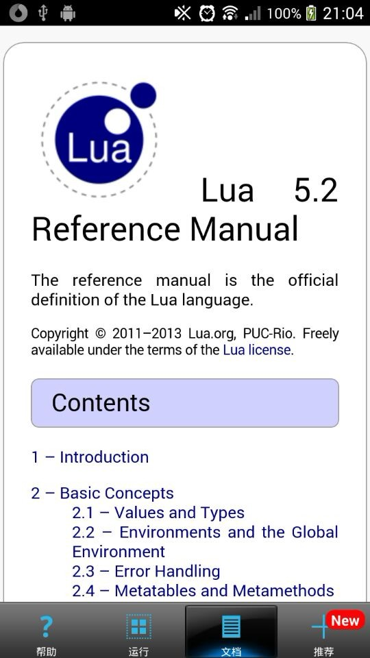

lua_run
=======

## android lua runer.

* 在安卓上编辑和运行lua

* 支持lua语法高亮

* 支持lua5.2.3版本

* 集成lua5.2离线文档

## 编译步骤


```
   $ cd lua_run
   $ android update project -p . -t android-19
   $ sh build_native.sh
```

## other

### 制作过程中借用了下面内容

* jota编辑器 <https://github.com/jiro-aqua/Jota-Text-Editor>

* 文件对话框 <http://blog.csdn.net/trbbadboy/article/details/7899424>

* 角标 <https://github.com/jgilfelt/android-viewbadger>

* lua文档 <http://www.lua.org/manual/5.2/>

### apk下载地址

* 豌豆荚：<http://www.wandoujia.com/apps/com.hanxi.luarun>

### 截图




